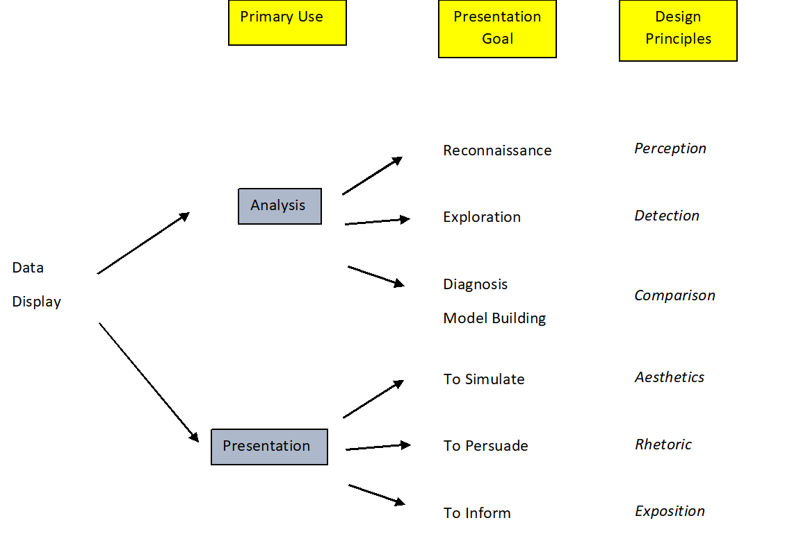
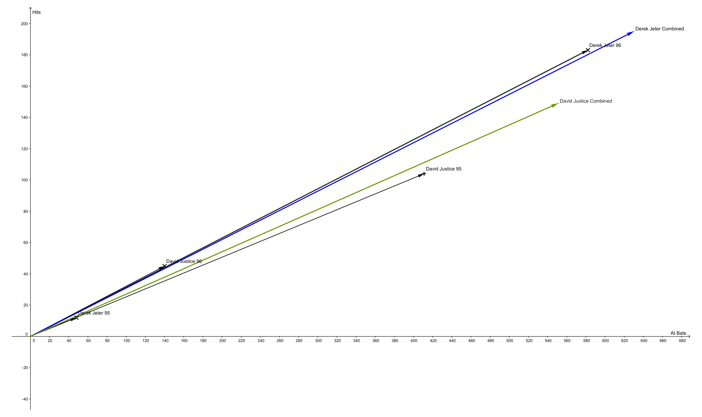

# Introducing Visual Analytics - Emphasis on Analytic Reasoning {#Chpt1}

>“The purpose of computing is insight, not numbers.” -- Richard Hamming

> "The simple graph has brought more information to the data analyst’s mind 
> than any other device." --- John Tukey

This chapter is a short introduction to visual analytics. It starts with a question, which can be understood to be the analytic reasoning leg of the visual analytics cycle. The second chapter is also an introduction to visual analytics but it takes more of a hypothesis generating point of view and thus has more emphasis on visualization and interaction. The depth that you as the instructor use depends on how much time can be devoted to this lesson.  This lesson could be done in a little as 30 minutes or as much as three 50 minute lessons.  These notes are broken into sections.  Under each section are some combination of definitions, explanations, discussion ideas, and problems as needed. You can drop portions or entire sections as needed or dictated by time.

Many of the ideas for this chapter come from friendly's excellent book on the analysis of discrete data [@FriendlyMeyer:2016:DDAR].


## Pre-Class Notes

Objectives  

After the training, participants will:
 
1. be able to define and explain visual analytics
2. be able to describe the three important components of visual analytics
3. be able to discuss types of unique insights that visual analytics can provide
  
Preparation

Prior to class: 

1. [Watch the Beauty of Data Visualization - David McCandless](https://www.youtube.com/watch?v=5Zg-C8AAIGg)  
2. [Watch TEDxWaterloo - Miriah Meyer - Information Visualization for Scientific Discovery](https://www.youtube.com/watch?v=Sua0xDCf8MA&feature=youtu.be)   
3. [Read the article Visual Analytics: Definition, Process, and Challenges by Daniel Keim, Gennady Andrienko, Jean-Daniel Fekete, Carsten Gorg,Jorn Kohlhammer, and Guy Melan](https://hal-lirmm.ccsd.cnrs.fr/lirmm-00272779/document) 

## Lesson Introduction {#Intro1}

Suggestions to start the lesson:

1.  Have the participants discuss the videos and explain insights gained for the preparation work..

2.  One of the objectives is to define and explain visual analytics.  A useful definition is (this can be given or developed by asking students for input): Visual analytics is the science of analytical reasoning facilitated by interactive visual interfaces.  

3) Discussion ideas and points for this portion of the lesson include:    
a) The goal of visual analytics is to create software systems that will support the analytical reasoning process.    
b) Visual analytics can be broken down into a form of analytical reasoning that relies on visual displays that are interactive.    
c) We must in turn explore and understand analytical reasoning, visual representation of data, and interactive interfaces.  This is a lead into the rest of this lesson.

Below is a diagram of the visual analytics process. It is a cycle where any one particular step can be a starting point, and ending point, and a transition point to another area of the cycle. For this lesson we will assume you start with a hypothesis and thus start with analytical reasoning. It is important to note that this is not always the case. You could start with data visualization in an exploratory manner and then move to either analytic reasoning or data visualization.  

  


## Analytic Reasoning {#AR1}  

This section introduces the concept of analytic reasoning and then uses an example to illustrate the ideas.

### Analytic Reasoing Explained

The goal of analysis is to make a decision about a question.  This question can be part of a larger analysis problem with many questions.  Analytic reasoning requires reasoning logically with the support of numeric evidence.  The analyst must understand the limitations of the data and the assumptions of the data transformations and summaries. Again it is important to note that analytics reasoning works in conjunction, not separate from, visualization and interaction. In other words, visual analytics takes analytical reasoning further by taking advantages of a visual and interactive representation of data to aid in the creation of knowledge products or actions.

Many analytical tasks follow a process of
• Information gathering
• Re-representation of the information in a form that aids analysis
• Development of insight through the manipulation of this representation
• Creation of some knowledge product or direct action based on the knowledge
insight.


### Example

We will introduce an example to highlight the ideas and principles of analytic reasoning.  The example we selected is easy to understand and allows us to present some of the important concepts of visual analytics.  You can pick an example of your own, but remember to keep it simple and easy to understand.   

#### Problem:  

Often in baseball, teams and fans want to compare players.  In the 1990s two extraordinary players were Derek Jeter of the New York Yankees and David Justice of the Atlanta Braves.  

#### Question: 

Who was the better baseball player?  Take some time and discuss how to answer the question.

#### Discussion ideas:  

There are many ways to try to answer this question.  Someone might say that Jeter was paid more therefore he is better.  Or someone would say that the Yankees are a better team and thus Jeter is better.  This is known as [butterfly reasoning](http://changingminds.org/disciplines/argument/types_reasoning/butterfly_logic%20.htm). Typically students will not use an analytic reasoning process but more of an intuition or perhaps just a bias. We have forced the students into an intuitive answer which will likely be based on biases and not empirical evidence. Next we will guide the students further along the path of analytic reasoning by narrowing the scope of the problem and introducing data.

### Second Example  

As another example, but this time using a social context, is the University of California - Berkeley admission bias question.  Running this as a lesson would look like this:

#### Problem:  

In the early 1970s there was a concern that the University of California - Berkeley was discriminating in its admissions process based on gender.  Question: How do we decide if Cal-Berkeley is practicing discrimination based on gender?  Take some time and discuss how to answer the question.

#### Discussion ideas:  

There are many ways to try to answer this question.  Someone might say that Berkeley had to be because this was the early 1970s and we know that institutional bias against women was common.  This is known as butterfly reasoning.  This is not analytical reasoning.  We must collect some data that will help us in deciding the answer.  In practice the is an iterative process.  

### Other problem ideas:  

i) In mathematics, deciding if a function is continuous at a point.  Generate a visual of a function and have an epsilon selected at random.  The decision maker must determine if there is a delta such that for all the points inside delta of x, the function is within epsilon of the limit.  
ii) In political science, we could use voter data to ask questions about coastal states versus central states.
iii) In biology, we could look at sports data such as Olympic race times.
iv) In engineering, we can look at strength of materials, completion times of projects, or design selection.

### Using Analytic Reasoning.  

We need data and a metric to help us answer the question of who is the better batter. There are many different ways to gather the data but this should be based on the metric we use. In sports analytics, there are many metrics that can be used to compare players, but for ease and the sake of an interesting analysis, we will use batting average. To make the problem even easier, we will provide the raw data from the years 1995 and 1996. Some students may object to this simplified data and you can use these objections as points of discussion on the importance of data that represents the question being asked. 

#### Information Gathering  

Here is the code to generate the raw data for both batters. The reason we are generating the data is that we simply have the summary data from the records and this is not how data is often obtained. The information gathering and cleaning can often represent a significant time investment. This is often lost on students as data is presented to them in a clean format because of class time concerns. To give the students a sense of the work involved, generate the raw data using the code below, and then give the csv file to them. 

First, we will generate a simple frequency form of the data, we are actually working backwards from how you would typically proceed in your analysis but this is done to save you time as an instructor. For this section we will need several packages; let's load them first.

```{r eval=FALSE}
library(vcd)
library(vcdExtra)
library(dplyr)
```


```{r}
MLB_freq<-data.frame(expand.grid(Player=c("Derek Jeter","David Justice"),
                    Year=c("1995","1996"),Result=c("Hit","Out")),
                count=c(12,104,183,45,48-12,411-104,582-183,140-45))
```

```{r}
knitr::kable(MLB_freq)
```


```{r}
MLB_long<-expand.dft(MLB_freq,freq="count")
head(MLB_long)
```

Now let's random shuffle to give the appearance of collected data. Note: we are using the dplyr package to complete this work.

```{r}
table(MLB_long$Year)
set.seed(81)
MLB_long<-MLB_long %>% 
  sample_frac() %>% 
  arrange(Year)
head(MLB_long)
table(MLB_long)
```


Now to get the data to students you could use the write.csv function

```{r eval=FALSE}
write.csv(MLB_long,"./data/batting.csv")
```

#### Transformation (Re-representation) of Data

The data is not in a form that will help make a decision. It is important to ask the students how they would transform the data to help make a decision. There are typically two responses to this request. The first is to get the batting averages for the two players. The second is to summarize the batting averages by each player within each year. This then begs the question of how to aggregate the two years. At this point, try to steer the students to comparing the batting averages within each year. They will note that David Justice has the higher in each year. The next question is how to transform this information into a single metric of overall batting averages. Also note at this point that our transformation is in the form of descriptive numeric summaries. This is often an important first step but in the next section we will work with visual representations of the data. Now, let's first get the batting average for each year.

#### Problem  

How should we transform, summarize, the data in a manner that will help us make a decision?

##### Discussion Ideas  

There are many ways to summarize the data. The problem is that we have hits and outs whereas we need total at bats. If we create summary, we will not get an appropriate metric of performance. 

```{r}
summary(MLB_long)
```

We are going have to transform the data. The first step would be to group the data by each of the variables.

```{r}
MLB_long %>%
  dplyr::group_by(Year,Player,Result) %>%
  dplyr::summarize(Total=n())
```

Or using different code


```{r first-tab}
knitr::kable(xtabs(~Player+Result+Year,MLB_long),caption = "A Simple Table Summarizing Batting Performance")
```  


This is a good first step but students will have to mentally try to find the total at bats, sum hits and outs, and then divide hits by at bats; see Table \@ref(tab:first-tab) and the simple table below it.

As a preview of the visualization section, consider the following table and think about how it presents the information.  

```{r first-taba}
ftable(xtabs(~Player+Year+Result,MLB_long))
```

It should be clear that it is hard to use these summaries to make a decision. In the next section we will discuss visualizing data to include the advantages and disadvantages of each type of table. But for now let's complete the discussion of comparing batting averages.

Next we need to get a batting average for each player in each year.

```{r}
prop.table(xtabs(~Player+Year+Result,MLB_long),1:2)[,,1]
```

or as in Table \@ref(tab:second-tab).

```{r second-tab}
knitr::kable(MLB_long %>% 
  group_by(Player,Year,Result) %>% 
  summarise(Hits=n()) %>% 
  filter(Result=="Hit") %>%
  left_join(MLB_long %>% 
              group_by(Player,Year) %>% 
              summarise(At_Bats=n()),by=c("Player","Year")) %>%
  select(-Result) %>%
  mutate(Avg=round(Hits/At_Bats,4)) %>%
  select(Player,Year,Avg) %>%
  arrange(Year,desc(Player)),caption="Batting Average in each Year")
```

#### Discussion Ideas  

Ask the students to decide who is the better player based on the batting averages. The students should point out that David Justice had a better batting average in each year. You can ask how you should combine these averages? The students may claim that it does not matter since David Justice was better in each year. They may also want to take a simple average, which again would lead to David Justice being the better player. Other students will note that the overall batting average is found by dividing totals hits by total at bats. Let's combine the hits and outs from each year by aggregating across years.

```{r}
prop.table(xtabs(~Player+Result,MLB_long),1)[,1]
```

```{r third-tab}
knitr::kable(MLB_long %>% 
  group_by(Player,Result) %>% 
  summarise(Hits=n()) %>% 
  filter(Result=="Hit") %>%
  left_join(MLB_long %>% 
              group_by(Player) %>% 
              summarise(Total=n()),by="Player") %>%
  select(-Result) %>%
  mutate(Avg=round(Hits/Total,4)) %>%
  select(Player,Avg) %>%
  arrange(desc(Player)),caption="Combined Batting Average for Both Years")
```

From Table \@ref(tab:third-tab) it now appears that Derek Jeter is the better player.


Who is the better player?  Why did we get different results depending on the summary? What concerns do you have with the summaries and data transformations we created?  


## Visualizing data (Re-representation) {#Viz1}  

We are still in the transformation or re-representation of information phase. Visualization helps in this phase of the analysis project. We will present many different types of visualizations and this is a transition to the next phase of the analysis titled manipulation. Having to write code over and over with small changes will lead us to the interaction phase. We will first address visualization. Although some authors would not consider tables as a visualization of data, we do. In this section, we will use two different forms of visualization, both a table and a vector plot.

### Background on Visualizing Data

Data visualization is a complicated and important subject.  You can get advanced degrees in the subject.  We will only give the basics principles and ideas in this section. There are three things that should always inform the visual summary you select and/or design. First, you must decide which ideas are important to communicate to the reader. This requires you to identify your key message, filter and summarize the data to a point that maintains that message without over-compressing the data, and finally think about how to communicate this idea. Second, what is the reader’s background and how will they understand or what will they take away from the visualization?  Tufte states that you should “respect your audience”. Think about such factors as how short-term memory limits the amount of information a reader can hold and how preattentive thought quickly picks up position, motion, shape, and color first.  Finally, consider the data type(s), what are the advantages and disadvantages of the data, what information is contained in the data, and what tools are needed to visualize this data? For example, color does a nice job with discrete variables although it could be used as a gradient for continuous variables.  Length is good for continuous variables.  Area is difficult for readers to compare although rectangular is not as difficult because of the linear comparison of each side.

Figure \@ref(fig:fig1), adopted from @FriendlyMeyer:2016:DDAR, is an excellent framework for thinking about visualization. Often, we first start in the analysis phase. For our current problem we are in the analysis phase with comparison being the primary design principle; we want to compare Derek Jeter to David Justice. At the end of the analysis we must present the results and this puts us in the presentation section. In each case the reader is different. In the analysis phase, we, the analyst, are the reader and maybe a few others on the analysis team. In the presentation, the readers can be from a variety of backgrounds often leading to a simpler presentation.  

```{r fig1, fig.cap="Visualization Purposes",echo=FALSE}

```


### Using Problem

In the batting average problem, we have compressed the results of individual bats into an average.  There was also the choice to leave year as a separate variable or to compress further into a single summary.  The compression to a batting average, weather accounting for year or not, lost an important element of the data and that is the magnitude of number of bats.  Understanding our reader, in this case the analyst but ultimately any reader for presentation, we should expect that most people will consider the value of the batting averages for each player during each year to be of equal value, that is they assume that the number of at bats is approximately equal.  Thus, in this example they will either compare Derek Jeter against David Justice each year or simply average the two years into a single number to make a decision on the better batter.  In either case, the reader may conclude that David Justice is the better batter. In developing our visual summaries we will have to take this into consideration.

### Discussion ideas 

The tables in the previous section are visual summaries but what are the limitations?  What are the key idea(s) for this problem?  How would you visualize this data?

Most students will only think about tables. In considering tables, how should the variables be ordered? That is, which variables should be rows and which should be columns? Should you use shading in the tables? 

### Visualization

We will examine two ways to visualize the data in our batting average problem. First we will continue to look at the tables and then move to a visualization that utilizes vectors.

#### Tables for Visualization  

In this section we will go through a series of tables and discuss advantages and disadvantages of each.

##### First Table  

The first table from the software is a default and looks like

```{r}
table(MLB_long)
```

Ask your students about their thoughts on this table. 

Some ideas that may come include the lack of a  title, the use of ", ,", and having the split on result because it is difficult to mentally combine for comparison.  Remember that the reader of this table is the analytic team. As an analyst, the use of ", ,"" in the titles and the splitting of result into two table may not bother you but it is still inefficient. Plus you as the analyst want the ability to control how the variables are arranged.

##### Additional Tables  

Let's start by finding a better representation of the table.

```{r}
ftable(table(MLB_long))
```

The advantage of this figure did not split the data. Note that the software automatically placed Player and Year in the rows. This placement makes it difficult to compare the years since they are separated by one line.

Next, we will sort the variables by the comparison we want to make. In this case we want players within years. This is called effect-ordering sorting [@FRIENDLY2003509].

```{r}
ftable(table(MLB_long),row.vars=c("Year","Player"))
```

As we discussed in Section \@ref(Intro1), the transitions between analysis, visualization, and interaction may be a cycle. So next we need to get the number of at bats.

```{r}
data.frame(MLB_long %>% 
   group_by(Player,Year,Result) %>% 
   summarise(Hits=n()) %>% 
   filter(Result=="Hit") %>%
   left_join(MLB_long %>% 
               group_by(Player,Year) %>% 
               summarise(At_Bats=n()),by=c("Player","Year")) %>%
   select(-Result) %>%
   arrange(Year))
```

This is getting better although we lost year as an outer row variable and we still need average instead of hits.

```{r}
data.frame(MLB_long %>% 
   group_by(Player,Year,Result) %>% 
   summarise(Hits=n()) %>% 
   filter(Result=="Hit") %>%
   left_join(MLB_long %>% 
               group_by(Player,Year) %>% 
               summarise(At_Bats=n()),by=c("Player","Year")) %>%
   mutate(Average=Hits/At_Bats) %>%
   select(Year, Player,Average,At_Bats) %>%
   arrange(Year))
```
This is a nice summary and makes it clear that we have years with a small number of at bats. We still have to clean up some things to improve the visualization. What are some ideas to improve it?

A caption should be provided with enough detail to describe the table. In addition, the default of 7 decimal places is too much. We will use 4 decimal places.

```{r}
knitr::kable(data.frame(MLB_long %>% 
   group_by(Player,Year,Result) %>% 
   summarise(Hits=n()) %>% 
   filter(Result=="Hit") %>%
   left_join(MLB_long %>% 
               group_by(Player,Year) %>% 
               summarise(At_Bats=n()),by=c("Player","Year")) %>%
   mutate(Average=round(Hits/At_Bats,4)) %>%
   select(Year, Player,Average,At_Bats) %>%
   arrange(Year)),caption="Batting Averages and Total at Bats for Both Years")
```

Finally, we should combine both years. It is clear that we can't just average the averages since the total at bats is different. We need to find the total hits and divide by the total at bats. This is Table \@ref(tab:third-tab) with the addition of the total at bats.

```{r}
knitr::kable(MLB_long %>% 
  group_by(Player,Result) %>% 
  summarise(Hits=n()) %>% 
  filter(Result=="Hit") %>%
  left_join(MLB_long %>% 
              group_by(Player) %>% 
              summarise(At_Bats=n()),by="Player") %>%
  select(-Result) %>%
  mutate(Average=round(Hits/At_Bats,4)) %>%
  select(Player,Average,At_Bats) %>%
  arrange(desc(Player)),caption="Combined Batting Average for Both Years with Total at Bats")
```

The two players had similar number of at bats but Derek Jeter had the higher batting average.

### Vectors for Visualization

In the previous section, we learned that representing performance with just batting average is potentially misleading. The decimal representation of the average is too much of a compression because we lose the important information on the number of at bats. Carried to an extreme, if a player only batted twice and got one hit, batting average would be reported as a staggering 0.500. We attempted to remedy this by also reporting the total number of at bats along side of the batting average. The other issue we had was in the bias people use to combine batting averages. If only batting averages are reported, people tend to want to average them. However, since the number of at bats changes from year to year a weighted average is needed. In fact the way to determine overall average is to add the total number of hits and divide by the total number of at bats. If in the first year is ${a \over b}$ and the second year is ${c \over d}$, then the overall average is ${(a+c) \over (b+d)}$. This is vector addition and gives another way to visualize the data; in the form of vectors and vector addition.

#### Discussion Ideas  

Now that we have described batting average, how to combine years, and the importance of the total at bats, is there a way to represent these in a plot?

#### Plot  

To plot both batting average and at bats is difficult so we will plot at bats on the x-axis and hits on the y-axis. In this case, the batting average is the angle, or the slope of the line. Angles are difficult to estimate but easy to compare.  We used color to separate the two batters only for the combined years.  We included the individual year breakdown but they are difficult to see.  We included points to bring them out.  The combination of years, or the calculation of combined batting average, is a vector addition and not the addition of fractions.  Vectors have both direction and length.  The direction is the number of hits over number of at bats, the traditional batting average.  The length is related to the number of at bats, it is really the Pythagorean length which combines hits and total at bats.  The plot shows that Derek Jeter’s combined batting average gets pulled more towards the second year where he had more at bats.  The opposite is true for David Justice and that is why we get the reversal of batting averages when we compress from two years down to one.

```{r fig2, fig.cap="Visualization of Batting Averages",echo=FALSE}

```


This might be hard to see in the document so you can open it separately as pdf to see the design of the graph better.  The link is http://bit.ly/2tP05tU 

#### Discussion Ideas  

What do you like about the plot?  What are the strengths and weaknesses? What changes would you make?  Is it better to put the players’ years end to end or does that hide that David Justice is better in each individual year? Does the color help or hurt?

The angle is the batting average, should we use white space in he graph and put an explanation into the graph?  What if we had three years, how would we represent them? The labels overlap the lines, should we move or offset them?  As a lead into the next lesson on interaction, selecting a year and turning it off as well as making lines more transparent could help.

The problems with this graph are that the lines are close together, the font size on the axis is too small, the label points are hidden by the lines, and the aspect ratio is not one so that it appears that the average is closer to a 45 degree line which is an average of 1.000.

#### Plots in R  

You can construct these plots in R although they are a bit awkward. However on the positive side we can control the aspect ratio, offset text, and change the font size.  To get an idea of how to do this consider the simple plot in Figure \@ref(fig:fig-simp). 

```{r fig-simp, fig.cap="Simple Example of visualization of Batting Averages"}
plot(1,type="n",xlim=c(0,800),ylim=c(0,800),xlab="At Bats",ylab="Hits",asp=1)
arrows(0,0,200,50,col="red")
arrows(200,50,400,150,col="red")
arrows(0,0,400,150,col="red")
abline(0,1)
```

Now using our data, Figure \@ref(fig:fig-better) shows that Derek Jeter is being pulled up to his 1996 average and David Justice is being pulled down to his 1995 average. 

```{r fig-better, fig.cap="Comparing Batting Averages for Derek Jeter and David Justice"}
plot(1,type="n",xlim=c(0,700),ylim=c(0,200),xlab="At Bats",ylab="Hits",asp=1)
arrows(0,0,48,12,col="black")
arrows(48,12,(48+582),(183+12),col="black")
arrows(0,0,(48+582),(183+12),col="red")
arrows(0,0,411,104,col="black")
arrows(411,104,(411+140),(104+45),col="black")
arrows(0,0,(411+140),(104+45),col="blue")
abline(0,1)
title("Comparing Batting Averages")
legend(1, 250, legend=c("Derek Jeter", "David Justice"),
       col=c("red", "blue"),lty=c(1,1), cex=0.8)
```

We can improve the look of the plot by using the **ggplot2** [@R-ggplot2] package. First let's get the data in a form to better using the plotting function. 

```{r}
plotdata<-data.frame(MLB_long %>% 
   group_by(Player,Year,Result) %>% 
   summarise(Hits=n()) %>% 
   filter(Result=="Hit") %>%
   left_join(MLB_long %>% 
               group_by(Player,Year) %>% 
               summarise(At_Bats=n()),by=c("Player","Year")) %>%
   select(Year, Player,Hits,At_Bats) %>%
   arrange(Year)) %>% 
   rbind(.,group_by(.,Player) %>%
   summarise(Hits=sum(Hits),At_Bats=sum(At_Bats)) %>%
   mutate(Year="Combined") %>%
   select(Year, Player, Hits, At_Bats)
   )
```

Now Figure \@ref(fig:fig-ggplot) compares the players. 

```{r fig-ggplot,fig.cap="Comparing Batting Averages for Derek Jeter and David Justice (Using ggplot)"}
plotdata %>%
  ggplot(aes(x=At_Bats,y=Hits)) +
  geom_point() +
  xlim(0,700)+
  ylim(0,200)+ 
  coord_fixed(ratio=1) +
  geom_segment(aes(x = 0, y = 0, xend = At_Bats, yend = Hits,color=Player),arrow=arrow(length=unit(.2,'cm'),type="closed")) +
  geom_text_repel(aes(x=At_Bats,y=Hits, label = Year)) +
  labs(title="Batting Averages")
```

#### Discussion Ideas  

What do you like about Figure \@ref(fig:fig-ggplot) as compared to Figure \@ref(fig:fig-better)? What changes would you make?  Is it better to put the players’ years end to end or does that hide that David Justice is better in each individual year? Does the color help or hurt?

#### More Discussion Ideas

If you want to use external resources to help your students, the following are good references:

http://junkcharts.typepad.com/junk_charts/  
http://flowingdata.com/   
http://www.storytellingwithdata.com/   

## Interaction {#Inert1}  

The third phase of the analysis is to develop insight through manipulation of representations. In some sense we did this in section \@ref(Viz1) by running different table and plots. This exercise was static and labor intensive. In this section we will introduce the use of interactive tools that reduce the need to re-write code. We will be using html widgets as this document is written in html. However, there are many other tools that can be used for interaction.


### Background Information on Interaction

The purpose of interaction in a visual display of data is the aid in the decision process.  It can be used to explain a concept, develop conjectures or insights, and/or facilitate an exploration.  This can lead to increased efficiencies and effectiveness of the decision making process. However, the science of understanding and implementing interaction is the least developed of the three areas.  This is partly due to the only recent availability of software to easily develop customized interactive displays.

The general principle of interaction is summarized as overview first, zoom on interest, filter to make specific, and provide details as required.  Interaction can add in decision making because by interacting with the data; the analyst and decision maker can transform data, alter visual display, and then form hypothesis or alter conditions to determine impact.

The biggest issue with interactivity is the ability to rapidly develop custom products.  Currently this requires programming skills and sophisticated software. This will change, and has to some extent with packages such as Tableau, as more tools are developed that remove the need to program.  

#### Simple Example 

To supplement this portion of the lesson, you may want to find interactive examples on the web. The following site has an example of a simple interactive visualization to help you facilitate a discussion on the effectiveness of an interactive to present an idea.


"https://hbr.org/2014/04/what-the-scarcity-of-women-in-business-case-studies-really-looks-like")

#### Discussion ideas  

What are the thoughts of the speed of the interaction?  Did the animation help or hurt?  What key idea did the authors want the reader to leave with from this visualization?  What good make it better.

### Our Problem

We could develop two interactive methods to explore the problem. One for the tables and the other for the vector plots.  

#### Interactive Tables

We will generate several tables that a student can interact with in an html document.

##### First Table  

Our first attempt at interaction is to create a table where you can sort the columns. First we create the dataframe.


```{r}
interdata<-data.frame(MLB_long %>% 
   group_by(Player,Year,Result) %>% 
   summarise(Hits=n()) %>% 
   filter(Result=="Hit") %>%
   left_join(MLB_long %>% 
               group_by(Player,Year) %>% 
               summarise(At_Bats=n()),by=c("Player","Year")) %>%
   select(Year, Player,Hits,At_Bats) %>%
   arrange(Year)) %>% 
   rbind(.,group_by(.,Player) %>%
   summarise(Hits=sum(Hits),At_Bats=sum(At_Bats)) %>%
   mutate(Year="Combined") %>%
   select(Year, Player, Hits, At_Bats)
   ) %>%
  mutate(Average=round(Hits/At_Bats,4))
```

Next we generate the table using the **DT** package [@R-DT]. 

```{r tab-fourth}
DT::datatable(interdata)
```

##### Discussion Ideas  

Have the students experiment with the table. some examples are to use the sorting arrows to sort by player first then year or subset the data to only show Derek Jeter, note use the search window.

What are the advantages and disadvantages of this interactive table?

##### Second Interactive Table 

For the second table we will use a pivot table using the **rpivotTable** package [@R-rpivotTable].  By default, we have fractions as a function of row totals.

```{r}
rpivotTable(MLB_long,rows=c("Year","Player"),cols="Result",aggregatorName="Count as Fraction of Rows")
```

##### Discussion Ideas  

Have the students first remove year to get the batting averages for each player. Now ask the students to experiment with the pulldown menus to create other summaries; sort using the small areas next to the aggregation pulldown menu; switch year and player and determine the output.

#### Interactive Vector Plots  

Without developing our own custom visualization of the vector plot, which we could do in [geogebra](https://www.geogebra.org/) or using the R package  **shiny**[@R-shiny], we decided to find an existing application on the web.  There is an interactive visualization application in the geogebra library, go to https://www.geogebra.org/m/YrPAV6KK.  The example uses shooting baskets but gives the same idea as the reversal we saw in our problem.  We selected this interaction because it helps explain why the reversal occurs and the conditions under which it occurs.  

#### Discussion ideas  

Have the participants move Lucy1 around by experimenting with the length and angle to determine when the reversal occurs.  What is the relationship between angle and the reversal?  What is the relationship between length and reversal?  Is it possible to have Tom as the better shooter regardless of Lucy’s actions as long as Lucy’s first and second day performances are less than Tom’s?  What are the strengths of the interaction tool?  What would have to be done to use it for our data? 

## Final Product 

The fourth phase of the analysis is the creation of a knowledge product. In this case the reader(s) will be varied. It is important to think about graphic design elements such as color, labels, font. The key point is to clearly define the message and then use the graphic elements to support this message.  

### Discussion Ideas  

What is the key message? What is the best method to communicate this message? Should we use a static graphic or an interactive display? 

### First Knowledge Product  

We think the key message is that Derek Jeter is the better batter than David Justice. We will use a static visual since interactive tools currently require access to the internet of special software.  Before coming up with our final knowledge product we will discuss ideas using our vector plot from Figure \@ref(fig:fig-ggplot), reproduced below.


```{r}
plotdata %>%
  ggplot(aes(x=At_Bats,y=Hits)) +
  geom_point() +
  xlim(0,700)+
  ylim(0,200)+ 
  coord_fixed(ratio=1) +
  geom_segment(aes(x = 0, y = 0, xend = At_Bats, yend = Hits,color=Player),arrow=arrow(length=unit(.2,'cm'),type="closed")) +
  geom_text_repel(aes(x=At_Bats,y=Hits, label = Year)) +
  labs(title="Batting Averages")
```

First let's change the theme to reduce the background color.


```{r}
plotdata %>%
  ggplot(aes(x=At_Bats,y=Hits)) +
  geom_point() +
  xlim(0,700)+
  ylim(0,200)+ 
  coord_fixed(ratio=1) +
  geom_segment(aes(x = 0, y = 0, xend = At_Bats, yend = Hits,color=Player),arrow=arrow(length=unit(.2,'cm'),type="closed")) +
  geom_text_repel(aes(x=At_Bats,y=Hits, label = Year)) +
  labs(title="Batting Averages")+
  theme_minimal()
```

Now let's improve the labels.


```{r}
plotdata %>%
  ggplot(aes(x=At_Bats,y=Hits)) +
  geom_point() +
  xlim(0,700)+
  ylim(0,200)+ 
  coord_fixed(ratio=1) +
  geom_segment(aes(x = 0, y = 0, xend = At_Bats, yend = Hits,color=Player),arrow=arrow(length=unit(.2,'cm'),type="closed")) +
  geom_text_repel(aes(x=At_Bats,y=Hits, label = Year)) +
  labs(title="Derek Jeter is Better than David Justice",x="Number of At Bats",y="Hits",
       subtitle="Batting averages for 1995 and 1996 as well as the combined averages")+
  theme_minimal()
```  

Finally, let's change the ticks on the axes and a different theme.

```{r}
plotdata %>%
  ggplot(aes(x=At_Bats,y=Hits)) +
  geom_point() +
  ylim(0,200)+ 
  coord_fixed(ratio=1) +
  geom_segment(aes(x = 0, y = 0, xend = At_Bats, yend = Hits,color=Player),arrow=arrow(length=unit(.2,'cm'),type="closed")) +
  geom_text_repel(aes(x=At_Bats,y=Hits, label = Year)) +
  labs(title="Derek Jeter is Better than David Justice",x="Number of At Bats",y="Hits",
       subtitle="Batting averages for 1995 and 1996 as well as the combined averages")+
  theme_bw() +
  scale_x_continuous(breaks=seq(0,600,50))
```  

### Discussion Ideas  

What do you like and dislike about the latest visual? Does it accomplish it goal of showing Derek Jeter is the better batter? What would you change?

### Second Knowledge Product  

```{r}
d=data.frame(x1=c(0,0), y2=c(0.3095,0.2704), y1=c(0,0), x2=c(.630,0.551), Player=c('Derek Jeter','David Justice'), r=c(630,551))
ggplot(d) + 
geom_rect(aes(xmin=x1, xmax=x2, ymin=y1, ymax=y2, fill=Player), color="black", alpha=0.5) + 
theme_classic() +
scale_fill_brewer(palette="Paired")  +
facet_grid(. ~ Player) +
scale_x_continuous(name="At Bats") + 
scale_y_continuous(name="Batting Average") +
#geom_text(data=d, aes(x=x1+(x2-x1)/2, y=y1+(y2-y1)/2, label=r), size=4) +
labs(title="Derek Jeter is a batter batter than David Justice",
     subtitle="Based on data from the years 1995 - 1996") +
geom_text(aes(x=x1+(x2-x1)/2, y=y1-0.01, label=r)) +
theme(axis.text.x = element_blank(),axis.ticks.x = element_blank(),legend.position = "none")
```


```{r}
d=data.frame(x1=c(0,0), y2=c(0.3095,0.2704), y1=c(0,0), x2=c(.630,0.551), Player=c('Derek Jeter','David Justice'), r=c(630,551))
ggplot(d) + 
geom_rect(aes(xmin=x1, xmax=x2, ymin=y1, ymax=y2, fill=Player), color="black", alpha=0.5) + 
theme_classic() +
scale_fill_brewer(palette="Paired")  +
facet_grid(. ~ Player) +
scale_x_continuous(name="At Bats",breaks=c(0,.25,.5,.75),labels=c("0", "250", "500","750")) + 
scale_y_continuous(name="Batting Average") +
labs(title="Derek Jeter is a batter batter than David Justice",
     subtitle="Based on data from the years 1995 - 1996") +
theme(legend.position = "none")
```


### Web Resources  

The following are some resource

https://www.r-bloggers.com/r-how-to-layout-and-design-an-infographic/ 

http://nandeshwar.info/data-visualization/how-to-create-infographics-in-r/ 

http://flowingdata.com/category/tutorials/ 


## Conclusion {#Conc1}

In conclusion of this section go back over the objectives and ask participants to explain and discuss.

Objectives

After the training, participants will:
 
1.    be able to define and explain visual analytics
2.    be able to describe the three important components of visual analytics
3.    be able to discuss types of unique insights that VA can provide


