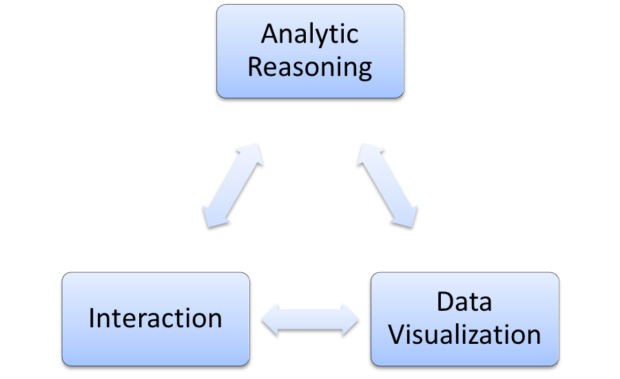

# Exploratory Visual Analytics {#Chpt2}

> “It isn’t accidental that when we begin to understand something we say 'I see.' 
> Not 'I hear' or 'I smell'” -- Stephen Few

> "You see alot just by looking"  -- Yogi Berra

> Visualization can surprise but doesn't scale well. Modeling scales well but cannot > surprise you. -- Hadley Wickham

In Chapter \@ref(#Chpt1) we illustrated the visual analytics process in Figure \@ref(fig:fig0). In that chapter, we started in the analytic reasoning section and then proceeded to visualization and interaction. This is typical when you begin with a research question and perform a more traditional analysis. In this chapter, we will be conducting what is known as an explanatory analysis in a visual analytic framework. We will start with visualization and explore relationships between variables. Ultimately, we will be recreating a chart similar to Hans Rosling's famous animated visualization from his [TED talk](https://www.ted.com/talks/hans_rosling_shows_the_best_stats_you_ve_ever_seen?language=en ). 

We will be using R to generate the display however, if you don't want to use R go the gapminder website, https://www.gapminder.org/, and under the header **tools**, you will have access to all the data as well as an interactive scatter plot. Another avenue you could explore is to use data directly from the [World Bank](https://data.worldbank.org/). On their website you can create interactive visual displays, https://data.worldbank.org/. 

The beginning of this chapter has a heavy, but reasonable, amount of data acquisition and preparation. This is often minimized in a typical lesson but in practice this part of the analysis comprises a significant portion of the time and effort in the project.

## Lesson Preparation

### Objectives:  

After the training, students will:
  
1.    be able to perform basic data manipulation and preparation
2.    be able to generate an animated visualization 
3.    be able to evaluate and compare visual displays of data 


### Preparation

Prior to class, complete the following 
1. Watch the video from [Hans Rosling](https://www.ted.com/talks/hans_rosling_shows_the_best_stats_you_ve_ever_seen#t-1052481) entitled "The best stats you've ever seen" .  

2. Go to the [gapminder website](https://www.gapminder.org/) and under the tab **tools**, experiment with the data.

## Lesson Introduction {#Intro2}

Suggestions to start the lesson:

1. In the video, Rosling mentions that his students believe that developed countries have long life expectancies and low birth rates while developing countries are the opposite. What are some other distinctions between these categories?  

There are many ways to answer this question and answers may include discussions about GPD, infant mortality rates, and age of population. One definition of [developed country](https://study.com/academy/lesson/economic-inequality-differences-in-developed-and-developing-nations.html) is 

>To be considered a developed nation, a country generally has a per capita income around or above $12,000

and other criteria can be found on [Wikipedia](https://en.wikipedia.org/wiki/Developed_country).

2.  What do you think made Hans Rosling's presentation so effective? What did you like about the visualizations? What are some of the design principles you learned from this video?

We are replicating Figure \@ref(fig:fig0) below to remind you of the process for visual analytics. We are assuming that you have read Chapter \@ref(Chpt1) even if you did not use the material. In this lesson we will be jumping into the visualization portion of the cycle first in an attempt to find insight. We are looking for a way to determine developed and developing countries and watch their progression over time. Thus we will go to analytical reasoning and interaction after starting with the visualization. We must start with data collection first.  

  

## Data Collection  

The data for this lesson comes from the [Gapminder](https://www.gapminder.org/data/) website. Again, you could just start with the **tools** application on the website instead of using the R code here. This section will be long but remember that data wrangling can take up to 80% of the time in a project. We also provide the final data in a csv file on the github site for this book. The file name is Gapminder_final.csv.  

### Load Packages  

First we will load two packages we need. The data is downloaded in a Excel spreadsheet; we will use the package **readxl** to read it.  In addition, R has a package called **gapminder** which is a subset of the data from the Gapminder website. We will use it to get country names to reduce the size of our data and exclude countries with a large amount of missing data.  

```{r eval=FALSE}
library(readxl)
library(gapminder)
library(tidyverse)
library(GGally)
library(plotly)
```

The data has been downloaded and is in the **data** folder on the GitHub site for this book.

### Population  {#Pop2}

The first data set we will be working with is the population for each country.

#### Import Data  

We will read the data in first.  

```{r}
gapminder_population_temp <- read_excel("data/indicator gapminder population.xlsx")
```

Let's look at the first few rows of the data.  

```{r echo=FALSE}
gapminder_population_temp %>% head() %>% knitr::kable()
```

From the **gapminder** package, we will get the subset of countries where the data is most complete.

```{r}
countries<-levels(gapminder$country)
```

Finally, we will wrangle the data into the final form needed.

```{r}
gapminder_population<-gapminder_population_temp %>%
  gather(year,pop,-"Total population") %>%
  rename(country="Total population") %>%
  mutate(year=as.integer(year),pop=as.integer(pop)) %>%
  filter(country %in% countries,year>=1950)
```

Table \@ref(tab:tab-pop) is the first 6 rows of our data.  

```{r tab-pop,echo=FALSE}
gapminder_population %>% head() %>% knitr::kable(caption="Population Data Arranged into Rows")
```

#### Quality Check

Before proceeding. We will check the quality of the data.

```{r}
length(countries)
length(unique(gapminder_population$country))
```

There are 142 countries in the **gapminder** data but only 139 in the data we collected that match those 142 countries. There might some names in **gapminder** that are different from those from the imported data. We will check this idea first.

```{r}
countries[!(countries %in% unique(gapminder_population$country))]
```

We are missing the two Koreas and Yemen from our data.

We need the full list of countries in the original data to change the names.

```{r}
gapminder_population<-gapminder_population_temp %>%
  gather(year,pop,-"Total population") %>%
  rename(country="Total population") %>%
  mutate(year=as.integer(year),pop=as.integer(pop)) %>%
  filter(year>=1950)
```


```{r}
unique(gapminder_population$country)[grep("Korea",unique(gapminder_population$country))]
unique(gapminder_population$country)[grep("Yemen",unique(gapminder_population$country))]
```

We now know the problem is that in the **gapminder** package we have the titles
"Korea, Dem. Rep."  
"Korea, Rep."  
"Yemen, Rep."  

while in our data from the gapminder website we have the names
"North Korea"  
"South Korea"
"Yemen"


We will correct the names in the our data.

```{r}
gapminder_population$country<-gsub("North Korea","Korea, Dem. Rep.",gapminder_population$country)
gapminder_population$country<-gsub("South Korea","Korea, Rep.",gapminder_population$country)
gapminder_population$country<-gsub("Yemen","Yemen, Rep.",gapminder_population$country)
```

We will check our data again.

```{r}
sum(!(countries %in% unique(gapminder_population$country)))
```

Finally we will get rid of the countries not in the **gapminder** package.

```{r}
gapminder_population<-gapminder_population %>%
  filter(country %in% countries)
```

Next we will look for missing observations.

```{r}
gapminder_population[is.na(gapminder_population$pop),]
```

We are missing the last two years of data for Taiwan. We could drop Taiwan or get another estimate of the population from the web.  Using the website http://www.worldometers.info/world-population/taiwan-population/ we see that for the last four years the population has grown by about 70000 each year. So we will estimate the population for 2014 and 2015 by adding 70000 to the population in 2013 for each year.. 

```{r}
gapminder_population[is.na(gapminder_population$pop),][1,3]=23151000 + 70000
gapminder_population[is.na(gapminder_population$pop),][1,3]=23151000 + 140000
```

#### Getting Data into Final Form  

Now we need to add the continents to the data frame. First we will get the country names and associated continent names from the **gapminder** package.

```{r}
dict<-gapminder %>% group_by(continent) %>% distinct(country) %>%
  mutate(country=as.character(country))
```

Now we can add the continent names using a `join` function.  

```{r}
gapminder_population <- gapminder_population %>% 
  left_join(dict,by="country") %>%
  select(country,continent,year,pop)
```

Table \@ref(tab:tab-final-pop) shows the form of the final data set.  

```{r tab-final-pop,echo=FALSE}
gapminder_population %>% head() %>% knitr::kable(caption="Final Population Data")
```

Clean up by removing temporary objects.

```{r}
rm(gapminder_population_temp)
```

#### Discussion Ideas  

Even though the video we watched used population, what are the disadvantages of using raw population? A large country will have a larger population because of size, what is another population metric that places the numbers on equal scale?

### Population  Density

Adjusting population by the size of the country gives a better basis to compare countries. We will import data from the gapminder website. The website has a data set on population density, the population divided by the area of the country in squared kilometers, but it only goes to the year 2010. The gapminder website also has a data file with the area of each country. It also only goes up to 2010. To find population density, we will import the surface area file and divide population by the surface area. This file only goes up to 2010 so we will have to assume that the area does not change in the last five years.


```{r}
gapminder_area <- read_excel("data/surface land.xlsx")
```

```{r}
gapminder_area <- gapminder_area %>%
  gather(year,area,-"Surface area (sq. km)") %>%
  rename(country="Surface area (sq. km)") %>%
  mutate(year=as.integer(year)) %>%
  filter(year > 1960,year<2011)
```

Next we need to check the country names.

```{r}
countries[!(countries %in% unique(gapminder_area$country))]
```

```{r}
unique(gapminder_area$country)[grep("Czech",unique(gapminder_area$country))]
unique(gapminder_area$country)[grep("Dominican",unique(gapminder_area$country))]
unique(gapminder_area$country)[grep("Central",unique(gapminder_area$country))]
unique(gapminder_area$country)[grep("Reunion",unique(gapminder_area$country))]
unique(gapminder_area$country)[grep("Taiwan",unique(gapminder_area$country))]
```

We are missing Taiwan and Reunion from the data and for the other three we have Republic names as Rep.

```{r}
gapminder_area$country<-gsub("Czech Rep.","Czech Republic",gapminder_area$country)
gapminder_area$country<-gsub("Central African Rep.","Central African Republic",gapminder_area$country)
gapminder_area$country<-gsub("Dominican Rep.","Dominican Republic",gapminder_area$country)
```

We will have to add Taiwan and Reunion after we complete the data consolidation.

```{r}
gapminder_area<-gapminder_area %>%
  filter(country %in% countries)
```

```{r}
gapminder_area %>% filter(is.na(area)) %>% select(country) %>% unique()
```

Belgium is missing data, so we will just fill just fill in the values with the value of 30530.

```{r}
gapminder_area %>% filter(country=="Belgium") %>% filter(!is.na(area))
```

```{r}
gapminder_area <- gapminder_area %>% replace_na(list(area=30530))
```

We will now merge with the population data and fill in the missing values.

```{r}
gapminder_popdensity <- gapminder_population %>%
  left_join(gapminder_area,by=c("country","year"))
```

Let's fill in Taiwan and Reunion. Taiwan is missing its density. The area of Taiwan is [36,000 squared kilometers](https://www.statista.com/statistics/321367/taiwan-land-area/) and the area of Reunion is 2510, .

```{r}
gapminder_popdensity[gapminder_popdensity$country=="Reunion","area"] = 2510
gapminder_popdensity[gapminder_popdensity$country=="Taiwan","area"] = 36000
```

No we will fill in the years prior to 1961 with the values from 1961.  

```{r}
gapminder_popdensity<- gapminder_popdensity %>% 
  group_by(country) %>% 
  fill(area,.direction="up") %>% 
  ungroup() %>% 
  arrange(year,country)
```

We will fill in the missing value in the tail with the most recent values.

```{r}
gapminder_popdensity<- gapminder_popdensity %>% 
  group_by(country) %>% 
  fill(area,.direction="down") %>% 
  ungroup() %>% 
  arrange(year,country)
```

We now calculate density by dividing population by area.

```{r}
gapminder_popdensity <- gapminder_popdensity %>% 
  mutate(density=pop/area) %>%
  select(-area)
```

We will add continent to the data frame.


Clean up the work space.

```{r}
rm(gapminder_area)
rm(gapminder_population)
```


### Life Expectancy  

Next we bring in life expectancy data and since the source is the same we will have the same issue with the names of the Koreas and Yemen. We will be performing the same steps as section \@ref(Pop2), so will skip the narrative on many of the steps.

```{r}
gapminder_lifeexp_temp <- read_excel("data/indicator life_expectancy_at_birth.xlsx")
```


```{r}
gapminder_lifeexp<-gapminder_lifeexp_temp %>%
  gather(year,life_exp,-"Life expectancy") %>%
  rename(country="Life expectancy") %>%
  mutate(year=as.integer(year)) %>%
  filter(year>=1950)
rm(gapminder_lifeexp_temp)
```

```{r}
gapminder_lifeexp$country<-gsub("North Korea","Korea, Dem. Rep.",gapminder_lifeexp$country)
gapminder_lifeexp$country<-gsub("South Korea","Korea, Rep.",gapminder_lifeexp$country)
gapminder_lifeexp$country<-gsub("Yemen","Yemen, Rep.",gapminder_lifeexp$country)
```

```{r}
gapminder_lifeexp<-gapminder_lifeexp %>%
  filter(country %in% countries)
```

```{r}
sum(is.na(gapminder_lifeexp))
```


```{r}
gapminder_lifeexp <- gapminder_lifeexp %>% 
  left_join(dict,by="country") %>%
  select(country,continent,year,life_exp)
```

Again \@ref(tab:tab-lifeexp) shows the final data set.  

```{r tab-lifeexp,echo=FALSE}
gapminder_lifeexp %>% head() %>% knitr::kable(caption="Final Life Expectancy Data")
```

### Fertility Rates  

Next fertility rates of a country may be an indication of its developmental state.

Read in the data.

```{r}
gapminder_fertility_temp <- read_excel("data/indicator undata total_fertility.xlsx")
```

Change the columns of year to a variable.  

```{r}
gapminder_fertility<-gapminder_fertility_temp %>%
  gather(year,fertility,-"Total fertility rate") %>%
  rename(country="Total fertility rate") %>%
  mutate(year=as.integer(year)) %>%
  filter(year>=1950)
rm(gapminder_fertility_temp)
```

Change out the names of the Koreas and Yemen.

```{r}
gapminder_fertility$country<-gsub("North Korea","Korea, Dem. Rep.",gapminder_fertility$country)
gapminder_fertility$country<-gsub("South Korea","Korea, Rep.",gapminder_fertility$country)
gapminder_fertility$country<-gsub("Yemen","Yemen, Rep.",gapminder_fertility$country)
```

Narrow the list of countries to those in the **gapminder** package.  

```{r}
gapminder_fertility<-gapminder_fertility %>%
  filter(country %in% countries)
```

Check the number of countries in the data frame.  

```{r}
length(unique(gapminder_fertility$country))
```

We need to check for missing values.

```{r}
sum(is.na(gapminder_fertility$fertility))
```

```{r}
gapminder_fertility[is.na(gapminder_fertility$fertility),]
```

It is the country of Taiwan again that has missing values. I will estimate the fertility with average of the previous 5 years.

```{r}
temp<-as.double(gapminder_fertility %>% filter(country=="Taiwan",year<2014 & year>2008) %>% summarise(ave=mean(fertility)))
gapminder_fertility<-gapminder_fertility %>% replace_na(list(fertility=temp))
rm(temp)
```


```{r}
gapminder_fertility <- gapminder_fertility %>% 
  left_join(dict,by="country") %>%
  select(country,continent,year,fertility)
```

Table \@ref(tab:tab-fertility) is the final form of the fertility data.  

```{r tab-fertility,echo=FALSE}
gapminder_fertility %>% head() %>% knitr::kable(caption="Final Fertility Data")
```

### Child Mortality  

Next we will collect data on child mortality. This data is the number of children out of 1000 born in the given year that will die before reaching the age of 5.

Read in the data.

```{r}
gapminder_mortality5_temp <- read_excel("data/indicator gapminder under5mortality.xlsx")
```

Arrange year from columns to a column.  

```{r}
gapminder_mortality5<-gapminder_mortality5_temp %>%
  gather(year,mortality,-"Under five mortality") %>%
  rename(country="Under five mortality") %>%
  mutate(year=as.integer(year)) %>%
  filter(year>=1950)
rm(gapminder_mortality5_temp)
```

Change the names of the Koreas and Yemen.

```{r}
gapminder_mortality5$country<-gsub("North Korea","Korea, Dem. Rep.",gapminder_mortality5$country)
gapminder_mortality5$country<-gsub("South Korea","Korea, Rep.",gapminder_mortality5$country)
gapminder_mortality5$country<-gsub("Yemen","Yemen, Rep.",gapminder_mortality5$country)
```

Narrow to the list of countries in the **gapminder** package.

```{r}
gapminder_mortality5<-gapminder_mortality5 %>%
  filter(country %in% countries)
```

We need to check for missing values.

```{r}
sum(is.na(gapminder_mortality5$mortality))
```

We have a large number of missing values.  

```{r}
gapminder_mortality5[is.na(gapminder_mortality5$mortality),]
```

Now Hong Kong, Puerto Rico, and Reunion are missing data up through the year 1979 and Taiwan is missing all years. We could drop Taiwan from the data but that is a waste of the data sets. We could impute the values but we need to be careful when we interpret the resulting plots. The other three countries are going to impose problems for the years prior to 1980.  For ease will will drop these countries from the analysis after we get our final data set.

```{r}
gapminder_mortality5 <- gapminder_mortality5 %>% 
  left_join(dict,by="country") %>%
  select(country,continent,year,mortality)
```

The final data for child mortality is in Table \@ref(tab:tab-mortality)

```{r tab-mortality, echo=FALSE}
gapminder_mortality5 %>% head() %>% knitr::kable(caption="Final Child Mortality Data")
```

### Aging Population  

Another idea is that developed countries have an older population by percentage. We will next collect data on the percent of population above 60 years in age.

Read in the data.

```{r}
gapminder_above60_temp <- read_excel("data/indicator_total above 60 percen.xlsx")
```


```{r}
gapminder_above60<-gapminder_above60_temp %>%
  gather(year,above_60,-"Total above 60 (%)") %>%
  rename(country="Total above 60 (%)") %>%
  mutate(year=as.integer(year)) %>%
  filter(year>=1950)
rm(gapminder_above60_temp)
```

This data came from a different source, so we need to be careful about the country names and which ones are contained in the data set.

```{r}
countries[!countries %in% unique(gapminder_above60$country)]
```

Taiwan is still a problem but now we have three other countries that are in the **gapminder** package and not in the new data set. This is a problem with naming similar to what we found when we were finding density. Let's correct the other first countries.

```{r}
unique(gapminder_above60$country)[grep("Czech",unique(gapminder_above60$country))]
unique(gapminder_above60$country)[grep("Dominican",unique(gapminder_above60$country))]
unique(gapminder_above60$country)[grep("Central",unique(gapminder_above60$country))]
```  

```{r}
gapminder_above60$country<-gsub("Czech Rep.","Czech Republic",gapminder_above60$country)
gapminder_above60$country<-gsub("Central African Rep.","Central African Republic",gapminder_above60$country)
gapminder_above60$country<-gsub("Dominican Rep.","Dominican Republic",gapminder_above60$country)
```

Let's remove Taiwan since we have no data on it. While we are at it, we will now also remove Hong Kong, Puerto Rico, and Reunion. We could drop all data prior to 1980 but this is 30 years of data. We will choose to drop these four small countries.

```{r}
final_countries<- countries[!countries %in% 
unique(gapminder_mortality5[is.na(gapminder_mortality5$mortality),]$country)]
```

Remove the four countries.

```{r}
gapminder_above60<-gapminder_above60 %>%
  filter(country %in% final_countries)
```

```{r}
sum(is.na(gapminder_above60$above_60))
```  

There are no missing values.

But the data is only for every 5 years and has projections past 2015. We will remove the projections and then interpolate for the remaining years.

```{r}
unique(gapminder_above60$year)
```

We will first remove the projections.

```{r}
gapminder_above60 <- gapminder_above60 %>% filter(year <= 2015)
```

Before we interpolate, let's plot at two countries to get an idea of the data.

```{r}
p<-gapminder_above60 %>% filter(country=="Albania" | country=="United States") %>%
  ggplot(aes(x=year,y=above_60,color=country))+
  geom_point() 
p
```

We will use a spline to interpolate the data but we will first plot a linear interpolation to compare with the spline.

```{r}
temp1<-data.frame(with(gapminder_above60 %>% 
        filter(country=="Albania"),approx(year,above_60,xout=seq(1950,2015)))) %>% 
  mutate(country="Albania")
temp2<-data.frame(with(gapminder_above60 %>% 
        filter(country=="United States"),approx(year,above_60,xout=seq(1950,2015)))) %>% 
  mutate(country="United States")
```


```{r}
p+
  geom_line(data=temp1,mapping=aes(x=x,y=y)) +
  geom_line(data=temp2,mapping=aes(x=x,y=y)) +
  labs(x="Year",y="Percentage of Population above 60 years",title="Estimating Percent of Population Above 60",subtitle="Linear Interpolation")
```

Now we will use a spline. It fits a cubic spline between each point and will be smoother than the linear interpolation.  

```{r}
temp1<-data.frame(with(gapminder_above60 %>% 
        filter(country=="Albania"),spline(year,above_60,xout=seq(1950,2015)))) %>% 
  mutate(country="Albania")
temp2<-data.frame(with(gapminder_above60 %>% 
        filter(country=="United States"),spline(year,above_60,xout=seq(1950,2015)))) %>% 
  mutate(country="United States")
```

```{r}
p+
  geom_line(data=temp1,mapping=aes(x=x,y=y)) +
  geom_line(data=temp2,mapping=aes(x=x,y=y)) +
  labs(x="Year",y="Percentage of Population above 60 years",title="Estimating Percent of Population Above 60",subtitle="Spline Interpolation")
```

Clean the work space.

```{r}
rm(temp1)
rm(temp2)
```

If you did not want the temporary variables we could have used the code in one step.

```{r eval=FALSE}
p+ data.frame(with(gapminder_above60 %>% 
  filter(country=="Albania"),spline(year,above_60,xout=seq(1950,2015)))) %>% 
  mutate(country="Albania") %>%
  geom_line(mapping=aes(x=x,y=y)) +
  data.frame(with(gapminder_above60 %>% 
  filter(country=="United States"),spline(year,above_60,xout=seq(1950,2015)))) %>% 
  mutate(country="United States") %>%
  geom_line(mapping=aes(x=x,y=y)) +
  labs(x="Year",y="Percentage of Population above 60 years",
       title="Estimating Percent of Population Above 60",subtitle="Spline Interpolation")
```


Now we need to interpolate for every country and create our final data frame. We will use the map function from the **purrr** package.  

```{r}
gapminder_above60<-gapminder_above60 %>%
  split(.$country) %>%
  map(~data.frame(spline(.$year,.$above_60,xout=seq(1950,2015)))) %>%
  map2_df(final_countries,~update_list(.x,country=.y)) %>%
  mutate(year=as.integer(x),above_60=y) %>%
  select(country,year,above_60) %>% as.tibble()
```

We finish by adding the continents.

```{r}
gapminder_above60 <- gapminder_above60 %>% 
  left_join(dict,by="country") %>%
  select(country,continent,year,above_60) %>%
  arrange(year,country)
```  

The final data frame.  

```{r}
gapminder_above60 %>% head() %>% knitr::kable()
```

Finally, cleaning up the figure of our data by removing the background shading.

```{r}
p+
  geom_line(data=gapminder_above60%>%filter(country=="Albania"),mapping=aes(x=year,y=above_60)) +
  geom_line(data=gapminder_above60%>%filter(country=="United States"),mapping=aes(x=year,y=above_60)) +
  labs(x="Year",y="Percentage of Population above 60 years",title="Estimating Percent of Population Above 60",subtitle="Spline Interpolation") +theme_classic()
```


### Final Data  

First we will do a quick quality check.

```{r}
table(gapminder_popdensity$continent)/66
table(gapminder_lifeexp$continent)/67
table(gapminder_fertility$continent)/66
table(gapminder_mortality5$continent)/66
table(gapminder_above60$continent)/66
table(dict$continent)
```

We have two problems left, the percentage of the population above 60 has less countries than the other data sets and life expectancy has one more year, 2016, than the other data sets. We will resolve this problem by dropping the 4 countries and the year 2016.

```{r}
gapminder_popdensity %>% summarise(Total=n_distinct(country))
gapminder_above60 %>% summarise(Total=n_distinct(country))
unique(gapminder_popdensity$country)[!unique(gapminder_popdensity$country) %in% final_countries]
```

We drop by using the join function.

```{r}
gapminder_va<-gapminder_above60 %>%
  left_join(gapminder_lifeexp,by=c("country","year","continent")) %>%
  left_join(gapminder_fertility,by=c("country","year","continent")) %>%
  left_join(gapminder_popdensity,by=c("country","year","continent")) %>%
  left_join(gapminder_mortality5,by=c("country","year","continent")) %>%
  arrange(year,country) %>%
  mutate(country=factor(country),pop=pop/100000) 
```  

Let's look at the data.

```{r}
gapminder_va %>% head() %>% knitr::kable()
```

Finally, we will write the data to a csv for use as needed for instruction.

```{r eval=FALSE}
write.csv(gapminder_va,file="data/Gapminder_final.csv")
```  

### Economic Data  

One last note is that we have not included an economic metric such as gross domestic product, GDP, per capita. The reason is that the data is sparse. On the gapminder website the data starts in 1960 and ends in 2011; in addition many countries are missing data. On the World Bank site, the data is more complete but still has many missing values and goes from 1960 to 2016. The data in the **gapminder** package in R has data for each country but only in five year increments and ends in 2007. if we want to include GDP data we would have to make the choice of limiting the number of years, interpolating, and/or removing more countries. It would be too much to extrapolate from 2007 to 2015, so a possible solution is to merge the World Bank data with the data from the **gapminder** package. However, they are inflation adjusted on different scales so a correction would have to be made. The World Bank data was in current US dollars while the **gapminder** package used something earlier, maybe 2000?

Here is some code to investigate how to incorporate GDP, but we will not complete it for our work. It is only a start to give you an idea of the work involved.

```{r}
gapminder_gdp_temp <- read_excel("data/World Bank GDP.xlsx",skip=4)
```

```{r}
gapminder_gdp<-gapminder_gdp_temp %>%
  gather(year,gdpPercap,-("Country Name":"Indicator Code")) %>%
  select(-(`Country Code`:`Indicator Code`)) %>%
  rename(country="Country Name") %>%
  mutate(year=as.integer(year)) 
```

We have a problem with the names of the countries again. 

```{r}
gdp_countries<-unique(gapminder_gdp$country)
countries[!countries %in% gdp_countries]
```

There is a problem, we will determine if these countries are in the new data set and then correct the names.

```{r}
ind<-vector()
for (country in final_countries[!final_countries %in% gdp_countries]){
  ind<-c(ind,grep(substr(country,1,6),gdp_countries))
}
gdp_countries[ind]
```

Let's fix the names. We know *Korea, Rep.* is correct, let's remove it.

```{r}
ind<-ind[-4]
```


```{r}
#Two vectors of names to run a loop over
old_names<-gdp_countries[ind]
new_names<-final_countries[!final_countries %in% gdp_countries]
for (i in seq_along(new_names)){
gapminder_gdp$country<-gsub(old_names[i],new_names[i],gapminder_gdp$country)
}
```


```{r}
gapminder_gdp<-gapminder_gdp %>%
  filter(country %in% final_countries,year>=1992,year<2017) %>%
  arrange(country,year)
```

Add continents to the data set.

```{r}
gapminder_gdp <- gapminder_gdp %>% 
  left_join(dict,by="country") %>%
  select(country,continent,year,gdpPercap) %>%
  arrange(year,country)
```

Now let's get the data from the **gapminder** package and compare the years to determine how to adjust.

```{r}
head(gapminder_gdp %>% filter(year == 2007) %>% select(gdpPercap)/
gapminder %>% filter(year == 2007,country %in% final_countries) %>% select(gdpPercap) -
(gapminder_gdp %>% filter(year == 2002) %>% select(gdpPercap)/
gapminder %>% filter(year == 2002,country %in% final_countries) %>% select(gdpPercap)))
```

The adjustment is not consistent so we may be lacking some understanding of how inflation adjustment is being done. We will stop here but if you wanted to continue, you would adjust the data from the World Bank to be consistent with the **gapminder** data and then use interpolation similar to what was done with percentage of population above 60.

We want to clean our work space.

```{r}
rm(gapminder_gdp_temp)
rm(gapminder_gdp)
rm(new_names)
rm(old_names)
```


### Summary of Data Collection  

To recap our data collection process, we will explain each variable. We have 138 countries on 5 continents for the years 1950 through and including 2015. Table \@ref(tab:final-tab) gives the first six rows of the data.

```{r final-tab,echo=FALSE}
gapminder_va %>% head() %>% knitr::kable(caption = "The First Rows of our Final Data Set")
```

Table \@ref(tab:data-desc) summarizes the variables in our final data set.

```{r data-desc,echo=FALSE}
text_tbl <- data.frame(
  Variable = c("above_60", "life_exp", "fertility","pop","density","mortality"),
  Description = c(
    "The percentage of the total population in a country that is above 60 years of age",
    "The average number of years a newborn child would live if current mortality patterns were to stay the same", 
    "The number of children that would be born to each woman with prevailing age-specific fertility rates",
    "The population of the country (100,000 people)",
    "The population of the country divided by the area of the country",
    "The probability that a child born in a specific year will die before reaching the age of five if subject to current age-specific mortality rates. Expressed as a rate per 1,000 live births"
  )
)
knitr::kable(text_tbl,caption="Description of Variables")
```

Next we will begin the process of visualizing the data.

## Visualization of Data 

In the next phase of our exploratory data analysis we will be visualizing the data. In Section \@ref(Viz1), we discussed some of the ideas of visualization. As a first step, we will be generating a visualization to help us understand the content of the data. This step is important in exploration as it often leads to insights into the next step.

### First Visualizations

In our first visualization we need to try to find key variables from the 9 total variables. The first three variables, country, continent, and year are different from the last seven and will have to be dealt with in a different manner. Country and continent are label variables. Year is a discrete count variable. The other 6 variables are continuous and can be plotted against each other on a scatterplot.

#### Discussion Ideas:

What are the first steps we should take to understand and visualize the data?

Are we doing reconnaissance or exploration, and what does that mean for the type of visualizations we want to create?

#### Summarize Data 

Let's perform a descriptive summary of our data.

```{r}
str(gapminder_va)
```

```{r}
summary(gapminder_va)
```

There are some potential issues with this data in terms of visualizing. First population and density have a large range. We may need to go to a logarithm scale. The variables country and continent are categorical and must be treated differently than the continuous variables. Finally, year is a count variable and we will have to deal with the 65 year span of data.

#### Matrix of Scatterplots

To get an overview of the data, let's plot the pairwise scatterplots for each of the continuous variables. We still need to address the issue with year, but for now we will just pick 1950.

```{r fig-mat1, fig.cap="Pairwise Scatterplots of Variables",warning=FALSE}
ggpairs(gapminder_va %>% filter(year==1950), columns = 4:9)
```

#### Discussion Ideas

Using Figure \@ref(fig:fig-mat1), discuss the following questions:  

What are advantages and disadvantages of the matrix scatterplot?  
What issues are revealed in the plot?  
What are some of the important conclusions that can be draws at this point in the exploration?  
What are some of the next steps that should be taken?

These plots do a nice job of comparing variables however it is restricted to pairwise comparisons. The correlation coefficient summaries the linear relationship between variables but the relationship between life expectancy and fertility may be non-linear. The density plots along the diagonal illustrate the data is at least bimodal, this may be an important insight if we want to separate countries into a binary distinction such as developed and developing. The variables population and density are dominated by a few very large values. It may be advantageous to link or brush data points to track them across plots. The background lines in the upper triangle of the matrix is confusing and makes reading difficult.

#### Adjustments

First let's put population and density on a logarithm scale.

```{r}
gapminder_va_log <- gapminder_va %>% 
  mutate(log_pop=log10(pop),log_density=log10(density)) %>% 
  select(-pop,-density)
```

```{r tab-va-log,echo=FALSE}
gapminder_va_log %>% 
  head() %>% 
  knitr::kable(caption="Data with Population and Density on a Log Scale")
```

Next we plot this new data set and add continent as a color.

```{r fig-mat2, fig.cap="Pairwise Scatterplots of Variables (Population and Density on Log Scale)",warning=FALSE,echo=FALSE,message=FALSE}
ggpairs(gapminder_va_log %>% filter(year==1950) %>% select(c(-1, -3)),aes(color=continent))
```

#### Discussion Ideas  

What is wrong with the mortality density plot?  
Which variables seem to have the potential to separate the countries into developed and developing ?  
Why is the point cloud for the Americas so wide?

Since Oceania only has two data points it is causing problems with the visual representation. We could continue with the exploration as is or combine Oceania with Europe since by most measures, except density, it is similar to Europe. The Americas combine North, Central, and South America together and the countries in this region have a wide range of values for the different variables. We may want to break them apart but that is only if we keep the analysis at the continent level and not the country level.

#### Recoding Oceania  

Let's combine Oceania into Europe. We will also check that our work is correct.

```{r}
table(gapminder_va_log$continent)
```


```{r}
gapminder_va_log$continent <- recode_factor(gapminder_va_log$continent,'Oceania'='Europe')
```


```{r}
table(gapminder_va_log$continent)
```

Now we will recreate the plot and add transparency to aid in visualization.

```{r fig-mat3, fig.cap="Pairwise Scatterplots of Variables with Oceania Removed",warning=FALSE,echo=FALSE,message=FALSE}
ggpairs(gapminder_va_log %>% filter(year==1950) %>% select(c(-1, -3)),aes(color=continent,alpha=.7))
```  

#### Discussion Ideas  

Do you see the bimodal feature we saw in previous plots?  
What are your thoughts on life expectancy versus mortality?  
What is the next step?  


It is now easier to see that a large part of the bimodal features were due to differences in continents. However, in the Americas we still see this bimodal nature.  It is expected that there is a strong linear relationship between life expectancy and mortality since they are related and do not offer different view of the population.

The next step is to bring in the variable year. We should focus on two variables. The pairs that show promise are above 60 and fertility or mortality and fertility. We can bring population or density into the plots as well.

### Next Visualizations  

To understand the progression of countries over time we need to look at different years. In the previous section we look only at the year 1950. In this section we will address different years.

#### Adding the Year 2015  

First let's look at the scatterplot matrix for the final year, 2015.


```{r fig-mat4, fig.cap="Pairwise Scatterplots of Variables for 2015",warning=FALSE,echo=FALSE,message=FALSE}
ggpairs(gapminder_va_log %>% filter(year==2015) %>% select(c(-1, -3)),aes(color=continent,alpha=.7))
```  

#### Discussion Ideas  

What changes do we see in the data compared to 1950?
What features still standout in the plots?

The countries of Asia, in terms of fertility and life expectancy, are now similar to Europe. The Americas still have the bimodal nature and Africa still lags the rest of the world. However, in general it appears countries are moving towards long life expectancy and low fertility. The variable above 60 is much different for Europe compared to the rest of the world.

It is hard to compare the 2015 plot with the 1950 since they are separate plots. We need to have a side by side comparison. 

#### Side by Side Comparison of 1950 and 2015 

To compare two years, let's focus first on just two variables, fertility and life expectancy.

```{r fig-sbs1, fig.cap="Side by Side Scatterplots for 1950 and 2015"}
ggplot(gapminder_va_log %>% filter(year==2015 | year==1950),aes(x=life_exp,y=fertility,color=continent)) +
  geom_point(alpha=.7)+
  facet_wrap(~year) +
  theme_bw()
```

#### Discussion Ideas  

How should the variable population be incorporated?
What insights are gained from this visualization?
Did changing the background theme help in the analysis?

It is clear from these plots that in general fertility rates are going down and life expectancy is increasing. There is less spread in the data as most countries are in the lower right corner of the 2015 plot. Africa still lags the rest of the world but it is also showing gains.

The background changed helped to visualize the data by removing the dark background. Making the data points a little translucent helped but maybe adding some jitter would also help. 

Population has not been incorporated but could be added by using size for population or density.

#### Population 

We can account for populaton by assigning it to another aestheic such as size. This will work better if we go back to original data. Using population density will also be better than population because this variable accounts for the size of the country. 

First, let's combine Oceania with Europe.

```{r}
gapminder_va$continent <- recode_factor(gapminder_va$continent,'Oceania'='Europe')
```

One concern is that population and density will have an extreme skewness with a few large values.  Let's summarize population and density.

```{r}
gapminder_va %>% filter(year==2015 | year==1950) %>% select(density,pop) %>% summary()
```

This confirms our suspicion. A country with a large population may not be one with a large density.  

```{r fig-sbs2, fig.cap="Side by Side Scatterplots of Density and Population for 1950 and 2015"}
ggplot(gapminder_va %>% filter(year==2015 | year==1950),aes(x=density,y=pop,color=continent)) + 
  geom_jitter() +
  facet_wrap(~year)
```

From Figure \@ref(fig:fig-sbs2) it is clear that density and population are dominated by a few large values. We will need to be careful when we use either as an aesthetic on our plots. We will break the size into a logarithmic type of scale. We are also going to change the color scheme to one from the [Brewer color scheme.](http://www.colorbrewer.org)

```{r fig-sbs3, fig.cap="Side by Side Scatterplots for 1950 and 2015 with Population Density"}
ggplot(gapminder_va %>% filter(year==2015 | year==1950),aes(x=life_exp,y=fertility,color=continent,size=density)) +
  geom_point(alpha=.7) +
  scale_size(name="Density",
             breaks=c(10,100,1000,4000,6000)) +
  scale_colour_brewer(palette="Dark2",name="Continent") +
  facet_wrap(~year) +
  theme_bw()
```

#### Discussion Questions  

Using \@ref(fig:fig-sbs3) answer the following questions:

What is happening to population density over the 65 years?  
Which continent has had the greatest increase in life expectancy?
Which country has had the greatest increase in life expectancy?

It is clear that as population increases from 1950 to 2015, the population density increases. The high density in 2015 of a few countries makes most of the data points seem to be the same size.

#### Adding a Third Year, 1982

We still have not adequately incorporated year into the visual exploration. As a next step, let's add a year that is between the end points, in this case 1982.

```{r fig-sbs4, fig.cap="Side by Side Scatterplots for 1950, 1982, and 2015 with Population Density"}
ggplot(gapminder_va %>% filter(year==1982 |year==2015 | year==1950),aes(x=life_exp,y=fertility,color=continent,size=density)) +
  geom_point(alpha=.7) +
  scale_size(name="Density",
             breaks=c(10,100,1000,4000,6000)) +
  scale_colour_brewer(palette="Dark2",name="Continent") +
  facet_wrap(~year) +
  theme_bw()
```

#### Discussion Questions  

Using Figure \@ref(fig:fig-sbs4) as a reference:

What features do you see in the data?
How should we incorporate year in a better format?

The shift from 1950 to 1982 was mostly an increase in life expectancy with a moderate decrease in fertility. although for some of the African countries, the fertility increased.  The period from 1982 to 2015 saw a big decrease in fertility whith a minor increase in life expectancy.

We could incoporate year by have a slider function to select year or another option is to animate the plot by year.

#### Using the Percentage of the Population Above 60

In our initial exploration, we also considered the variable population percentage above the age of 60.

```{r fig-sbs5, fig.cap="Side by Side Scatterplots of Fertility and Percentage of Population above 60 for 1950, 1982, and 2015 with Population Density"}
ggplot(gapminder_va %>% filter(year==1982 |year==2015 | year==1950),aes(y=above_60,x=fertility,color=continent,size=density)) +
  geom_point(alpha=.7) +
  scale_size(name="Density",
             breaks=c(10,100,1000,4000,6000)) +
  scale_colour_brewer(palette="Dark2",name="Continent") +
  facet_wrap(~year) +
  theme_bw() +
  labs(x="Fertility",y="Percentage of Population above 60")
```

#### Discusssion Ideas

From Figure \@ref(fig:fig-sbs5), notice that we also cleaned up the axes labels, answer the following questions:

What new insights are gained from this plot?  
What are some of the trends?  

Again, we see that in 1950 Europe is different from the other continents with a low fertility rate and a higher percentage of the population over 60. We do not see an again population in Africa over the entire time span. The fertility is going down in Africa but the percentage of the population over 60 is not changing. The continent with the biggest change over the 65 years is Asia. Again, it is hard to identify countries but we see an increase in population density. The change in density in Europe is not significant.

We need to brush and identify. In 2015 one Asian country has high percentage of population above 60.

#### Parallel Coordinates Plot

Another type of plot for our data is a parallel coordiantes plot. This plot scales the data first so that the size of the variables will not dominate the plot. We will also use the data with density and population on a logarithmic scale. The order of the variables is key as well. 

```{r fig-pc1, fig.cap="Parallel Coordinate Plot for 1950 and 2015. Population and Density are on a Log Scale."}
ggparcoord(gapminder_va_log %>% filter(year==1950 | 
  year==2015),columns=4:9,group='continent',
  order = c(6,7,5,4,8,9)) +
  scale_colour_brewer(palette="Dark2",name="Continent") +
  facet_wrap(~year) +
  theme_bw() +
  labs(x="Variables",y="Scaled Values")
```

#### Discussion Ideas  

Using Figure \@ref(fig:fig-pc1) answer the following questions:

Do population and population density aid?
What do we observe over the two time periods?
What order would you use for the variables and why?

We put fertility and mortality first since Europe was lower on both of the metrics in 1950 than the other continents. We place population and population density at the end since there was no decernible pattern. 

We again see that over time that the countries are becoming closer together in the metrics. The exception appears to be that Europe has a high percentage of the population over 60 relative to the rest of the planet.

We should remove population and population density to clean up the plot, see Figure \@ref(fig:fig-pc2).

We need the ability to identify countries and to link the plots.

```{r fig-pc2, fig.cap="Parallel Coordinate Plot for 1950 and 2015. Population and Density are on a Log Scale."}
ggparcoord(gapminder_va_log %>% filter(year==1950 | 
  year==2015),columns=4:7,group='continent',
  order = c(6,7,5,4)) +
  scale_colour_brewer(palette="Dark2",name="Continent") +
  facet_wrap(~year) +
  theme_bw() +
  labs(x="Variables",y="Scaled Values")
```


## Interactions with Visualizations  


```{r}
ggplotly(ggparcoord(gapminder_va_log %>% filter(year==1950 | 
   year==2015),columns=4:9,group='continent',
   order = c(6,7,5,4,8,9),alphaLines = 0.5) +
   scale_colour_brewer(palette="Dark2",name="Continent") +
   facet_wrap(~year),tooltip="continent")
```
ggplotly(ggplot(gapminder_va_log %>% filter(year==1982 |year==2015 | year==1950),aes(y=above_60,x=fertility,color=continent,text = paste("country:", country))) +
  geom_point(alpha=.7)+
  facet_wrap(~year) +
  theme_bw())
  
ggplotly(ggplot(gapminder_va_log %>% filter(year==1982 |year==2015 | year==1950),aes(y=above_60,x=fertility,color=continent,text = paste("country:", country))) +
  geom_point(alpha=.7)+
  facet_wrap(~year) +
  theme_bw(),tooltip="text")
  
ggplotly(ggplot(gapminder_va_log %>% filter(year==1982 |year==2015 | year==1950),aes(y=above_60,x=fertility,color=continent,text = country)) +
  geom_point(alpha=.7)+
  facet_wrap(~year) +
  theme_bw(),tooltip=c("text","fertility","above_60"))