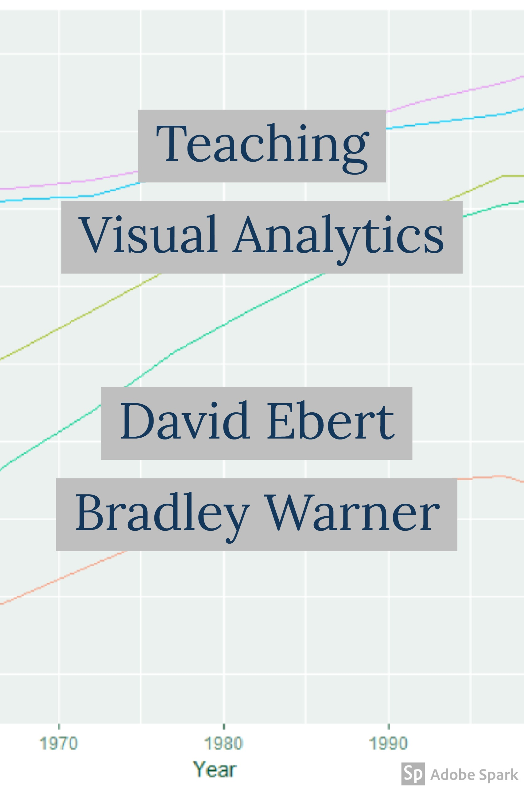

--- 
title: "Lesson Modules for Teaching Visual Analytics"
author: 
  - "Bradley Warner"
  - "David Ebert"
date: "`r Sys.Date()`"
site: bookdown::bookdown_site
output: 
  bookdown::gitbook:
    css: style.css
    split_by: "section"
    config:
      toc:
        collapse: subsection
        scroll_highlight: yes
        before: <li><a href="./">Lesson Notes for Visual Analytics</a></li>
        after: <li><a href="https://github.com/BawCOS/undergraduate-statistics-notes" target="blank">Published with bookdown</a></li>
      toolbar:
        position: fixed
      edit : https://github.com/BawCOS/undergraduate-statistics-notes/edit/master/%s
      download: ["pdf", "epub"]
      search: yes
      fontsettings:
        theme: white
        family: sans
        size: 2
documentclass: book
nocite: | 
  @xie2015,@agresti2003categorical
bibliography: [bibliography.bib, packages.bib,article.bib]
biblio-style: apalike
link-citations: yes
github-repo: BawCOS/undergraduate-statistics-notes
description: "A set of lesson notes to accompany the book Foundations and Application of Statistics: An Introduction Using R by Randall Pruim.  This is for a one semester course and does not use the entire book."
---

# Preface {-}

  


http://socviz.co/lookatdata.html 
http://serialmentor.com/dataviz/ 


## Who is this book for?


## Book Structure and How to Use It

Introduction:  This is a work is the result of an effort between the VACCINE lab at Purdue University and the United States Air Force Academy to develop a smaller set of lesson to introduce the field of visual analytics (VA).  Since many institutions do not have the resources to offer complete courses on VA, it was decided that standalone lessons plans have the potential for more use and dissemination.   

Intent:  These modules are designed to help participants:
Understand the definition and value of visual analytics
Explain and use design principles for visual analytics
Use visual analytics to explore and reach a decision for a problem

Use:  The first chapter is a short introduction to visual analytics. It starts with a question, which can be understood to be the analytic reasoning leg of the visual analytics cycle. The second chapter is also an introduction to visual analytics but it takes more of a hypothesis generating point of view and thus has more emphasis on visualization and interaction. The third chapter is an in-depth  chapters give in-depth lessons into each of the three knowledge areas, analytic reasoning, visualization, and interaction.


## Prerequisites

WHY USE R what if you don't want to

These notes make use of the following packages in R **knitr** [@R-knitr], **rmarkdown** [@R-rmarkdown], **fastR** [@R-fastR], **Hmisc** [@R-Hmisc], **lattice** [@R-lattice], **vcd** [@R-vcd], **ggplot2** [@R-ggplot2], **MASS** [@R-MASS], **TeachingDemos** [@R-TeachingDemos], **Stat2Data** [@R-Stat2Data], **car** [@R-car], **DT** [@R-DT],**crosstalk** [@R-crosstalk], **leaflet** [@R-leaflet], **plotly** [@R-plotly].

## Acknowledgements 

The workshop, GT, UCGA, Purdue, USAFA ....

This book was written using the excellent **bookdown** package [@R-bookdown].


  

This book is licensed under the [Creative Commons Attribution-NonCommercial-ShareAlike 4.0 International License](http://creativecommons.org/licenses/by-nc-sa/4.0/).

```{r include=FALSE}
# automatically create a bib database for R packages
knitr::write_bib(c(
  .packages(), 'bookdown', 'knitr', 'rmarkdown','fastR','Hmisc','lattice','vcd','ggplot2','MASS','TeachingDemos','Stat2Data','car','DT','leaflet','crosstalk','plotly','tidyr','vcdExtra'
), 'packages.bib')
```

```{r warning=FALSE,message=FALSE,include=FALSE}
library(fastR)
library(Hmisc)
library(lattice)
library(vcd)
library(vcdExtra)
require(ggplot2)
library(MASS)
library(TeachingDemos)
library(Stat2Data)
library(car)
library(DT)
library(plotly)
library(dplyr)
library(htmlwidgets)
library(rpivotTable)
library(crosstalk)
library(leaflet)
library(d3scatter)
library(tidyr)
```

